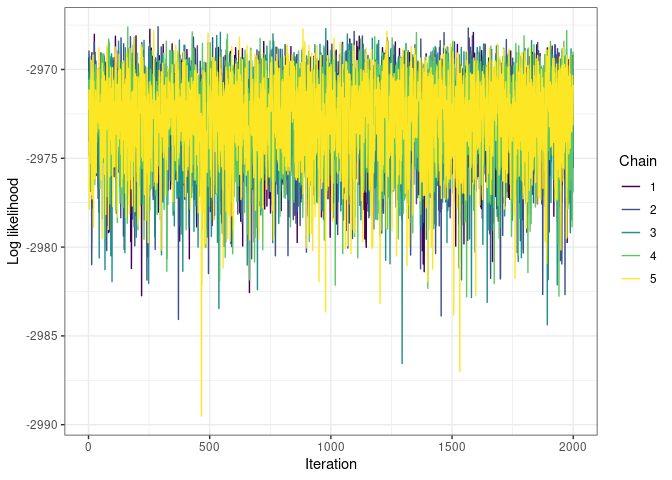
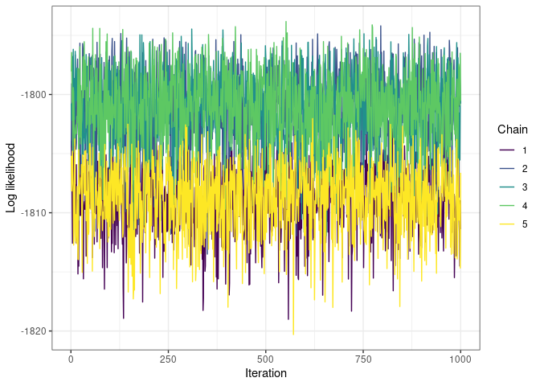

<!-- README.md is generated from README.Rmd. Please edit that file -->

# DesmanResultsAnalysis

<!-- badges: start -->
<!-- badges: end -->

The goal of DesmanResultsAnalysis is to provide some diagnostics to
check how DESMAN is doing and whether we can trust its results

## Installation

You can install the development version of DesmanResultsAnalysis from
[GitHub](https://github.com/) with:

``` r
# install.packages("devtools")
devtools::install_github("konkam/DesmanResultsAnalysis")
```

## How to use the package ?

This is a basic example which shows you how to analyse DESMAN results.

``` r
library(DesmanResultsAnalysis)
## basic example code
```

First, decide which files you wish to analyse by giving the path to the
folder containing the results:

``` r
path_desman_results <- "nathan_test/"
```

### Looking at the trace of the log-likelihood

#### 1 variant: looks ok

``` r
log_likelihood_trace(number_of_variants = 1, include_warmup = T, prefix = path_desman_results)
```



#### 2 variants: mixing looks good within chain but not among chains

``` r
log_likelihood_trace(number_of_variants = 2, include_warmup = F, prefix = path_desman_results)
```



#### 4 variants: same problem, good mixing within chain, bad mixing among chains

``` r
log_likelihood_trace(number_of_variants = 4, include_warmup = F, prefix = path_desman_results)
```


### Looking at the estimation of the error matrix

#### 1 variant: looks ok

``` r
eta_trace(number_of_variants = 1, include_warmup = T, prefix = path_desman_results)
#> Registered S3 method overwritten by 'GGally':
#>   method from   
#>   +.gg   ggplot2
```


### 2 variants: mixing looks good too

``` r
eta_trace(number_of_variants = 2, include_warmup = T, prefix = path_desman_results)
```


#### 4 variants: although we can see that the chains are not mixing, no striking problem with the error estimates

``` r
eta_trace(number_of_variants = 4, include_warmup = F, prefix = path_desman_results)
```


### Looking at the nucleotides

Here we count the number of As, Cs, Ts, Gs in the genome of each variant
at each iteration. This diagnostic shows that the sequence of the
nucleotides does not change along the iterations, highlighting the main
problem with DESMAN -\> the Gibbs sampler does not mix.

#### For 1 variant: the inferred genome does not change -\> no mixing

``` r
nucleotide_count_trace(number_of_variants = 1, include_warmup = T, prefix = path_desman_results)
```


#### For 2 variants: the inferred genome does not change -\> no mixing

``` r
nucleotide_count_trace(number_of_variants = 2, include_warmup = T, prefix = path_desman_results)
```


### Exploring the relative abundances

#### Visualising the relative abundances for troubleshooting

There are many samples and variants, so it’s better to plot only a
subset of the samples.

``` r
gamma_trace(number_of_variants = 2, prefix = path_desman_results, samples = c(1,2))
```


By default, all variants are plotted, but when the number of variants
starts to be large, it’s possible to plot only a subset of them via a
dedicated keyword

``` r
gamma_trace(number_of_variants = 4, prefix = path_desman_results, samples = c(1,2), variants = 1:3)
```


#### Summarising the relative abundances

We do not plot the relative abundances with only 1 variant, since they
are trivially 1 everywhere. Here, you should choose the chain with the
lowest deviance.

``` r
plot_relative_abundance(number_of_variants = 4, chain = 2, prefix = path_desman_results)
#> Joining with `by = join_by(Parameter)`
```


I did not include a function to choose this chain automatically, but it
may be guessed by looking at the log likelihood trace plot. The deviance
is related to minus the likelihood, so choosing the chain with the
lowest deviance amounts to choosing the chain with the largest
likelihood.

``` r
log_likelihood_trace(number_of_variants = 4, include_warmup = F, prefix = path_desman_results)
```


Here, chain 2 is probably the one with the highest likelihood
