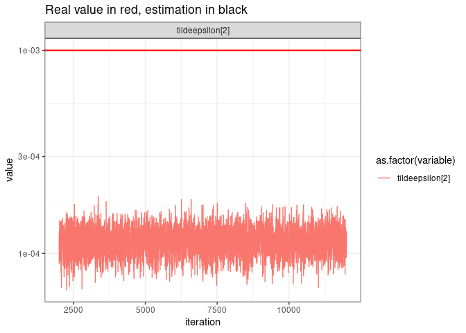
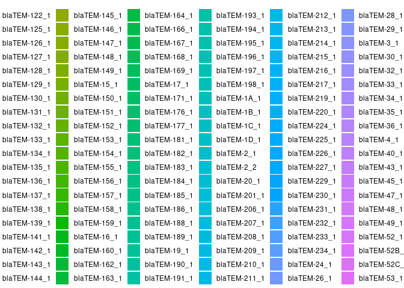

MCMC report
================

    ## [1] "runjags"

# Setup

## Project ID

fixed_variants_large_dictionnary

## Input data

The counts per position, sample and nucleotides array was obtained from:
[/work_projet/ala/metachick-fugace/Analyses_Ouléye/DESMAN_2023/DESMAN_iterAddPost/DESMAN_blaTEM_1A_1_HM749966/freq2Desman.txt]()

The fasta file used for the dictionnary was:
\[/work_projet/ala/metachick-fugace/BD/allTEM.fasta\]

## Desman Tuning parameters

10000
1000
1000
0.001
0.01
2
0.1

# Results

## Free epsilon

``` r
plot_bar_epsilon(mcmc_output = mcmc_output,bar_epsilon_1 = desman_tuning_parameters$bar_epsilon_1)
```

    ## Warning: Using `size` aesthetic for lines was deprecated in ggplot2 3.4.0.
    ## ℹ Please use `linewidth` instead.
    ## This warning is displayed once every 8 hours.
    ## Call `lifecycle::last_lifecycle_warnings()` to see where this warning was
    ## generated.

<!-- -->

``` r
plot_pi(mcmc_output,n_vsa =n_vsa,variants = variants)
```

<!-- -->

## Fixed epsilon

``` r
plot_pi(mcmc_output=mcmc_output_fixed_epsilon,n_vsa =n_vsa,variants = variants )
```

<!-- -->
\# Reproduction To reproduce the code: If not done, clone the
[https://github.com/konkam/DesmanResultsAnalysis](repo)

then run:

``` r
library(targets)
Sys.setenv(TAR_PROJECT = 'fixed_variants_large_dictionnary')
tar_make()
```
